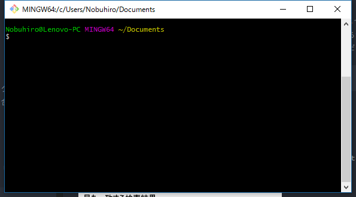
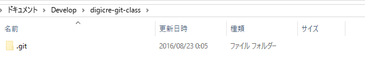

# 3.はじめてのGit

## Gitを触ってみよう

### 環境確認

まずGitをすこしいじってみましょう。ここからはみなさんのPCにGitが入っており、それにパスが通っていることを前提として進めます。自分の環境が整っているかを確認するには、コマンドプロンプトを起動して次のようにコマンドを実行してください。

```cmd
where git
```

実行してパス名が表示されていれば問題ありません。

## git init

### Git Bashを起動しよう

とりあえず、Gitを利用してみましょう。 Windows の検索ボックスで「git bash」と検索してみてください。もしgit bashがある場合はこのようになります。


それをクリックするとこのようなウィンドウが表示されます。



これはWindowsのコマンドプロンプトのように使えますが、Windowsのコマンドプロンプトより便利です。これからはこのGit Bashを使っていきます。もしもGit Bashが存在しない場合はコマンドプロンプトでも同じように使うことができます。

### Gitの初期設定をしよう

Gitを使っていく前に、Gitの初期設定を行います。Gitには誰がファイルを変更したかを把握するためにユーザー名とメールアドレスを登録する必要があります。

起動したGit Bashで次のコマンドを実行します。

```bash
# ユーザー名設定
git config --global user.name "ユーザー名"
# メールアドレスを設定
git config --global user.email "メールアドレス"
```

ユーザー名とメールアドレスは自分のものを指定してください。ユーザー名に日本語を使うと不具合を生じる可能性があるので、思いつかない場合は自分の名前をローマ字にしたものなどでもよいでしょう。

### 作業ディレクトリの作成

これからGitの勉強をしていく中で、作業するためのディレクトリを作成します。デスクトップに作成してもよいのですが、デスクトップに作成してしまうと整理がしづらくなってしまいます。ドキュメントの下にDevelopなどのフォルダを作成し、さらにその下に作成していくのがよいでしょう。参考までに筆者のDevelopフォルダを下に表示しておきます。


Git bashからドキュメントフォルダにDevelopフォルダを作成するためには、次のコマンドを実行します。

```bash
cd Documents/
mkdir Develop
cd Develop/
```

作業ディレクトリの名前は何でもよいのですが、とりあえず「digicre-git-class」とでもしておきましょう。

```bash
mkdir digicre-git-class
cd digicre-git-class/
```

これで作業用ディレクトリを作成することができました。

### Git initを実行

Git を使うためにはまずそのディレクトリをGitレポジトリにする必要があります。レポジトリ（Repository）とは、貯蔵庫・容器などを意味する英単語であり、Gitレポジトリの中でファイルの変更履歴などを保存することができます。つまりGitレポジトリとなったディレクトリの中でないと、Gitを使うことはできないということです。

この辺りはすこし難しいので、わからなければとりあえず飛ばしてしまって構いません。とりあえず次のコマンドを実行してください。

```bash
git init
```

すると、次のようなメッセージが表示されます。

```
Initialized empty Git repository in C:/Users/Nobuhiro/Documents/Develop/digicre-git-class/.git/
```

これはそのディレクトリがGitで管理できるようになったことを表します。実際にどうなっているかを少し確認してみましょう。

Git Bashの上で次のコマンドを実行してください。

```bash
start
```

すると、Windowsのエクスプローラが起動します。次のようなディレクトリ構成になっているでしょう。



ここにある .git フォルダーはいじらないようにしてください。この中に変更情報などが保存されていくことになります。

## まとめ

* Gitをインストールしたらまずユーザー名とメールアドレスを設定する
* `git init`をするとGitで管理できるようになる
