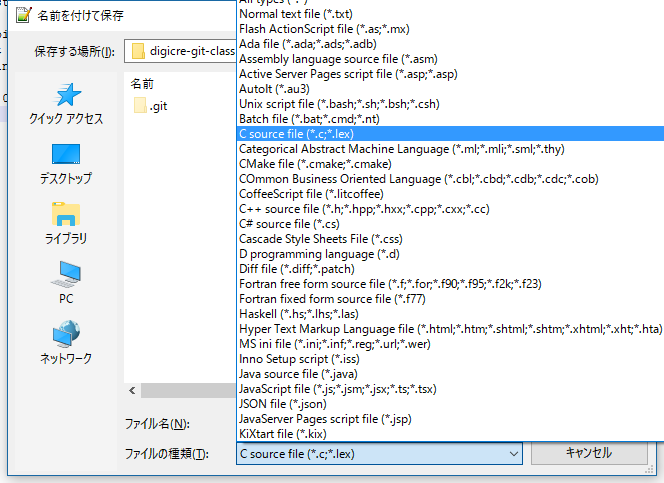
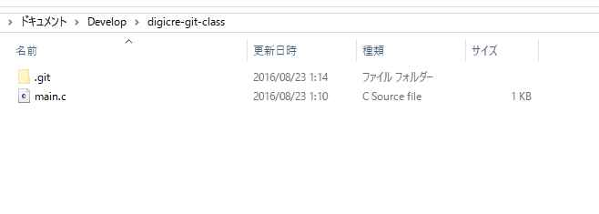
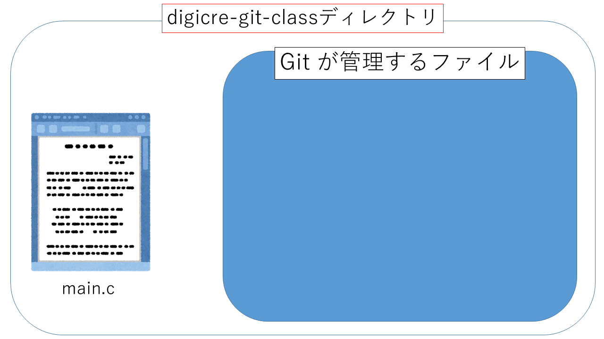
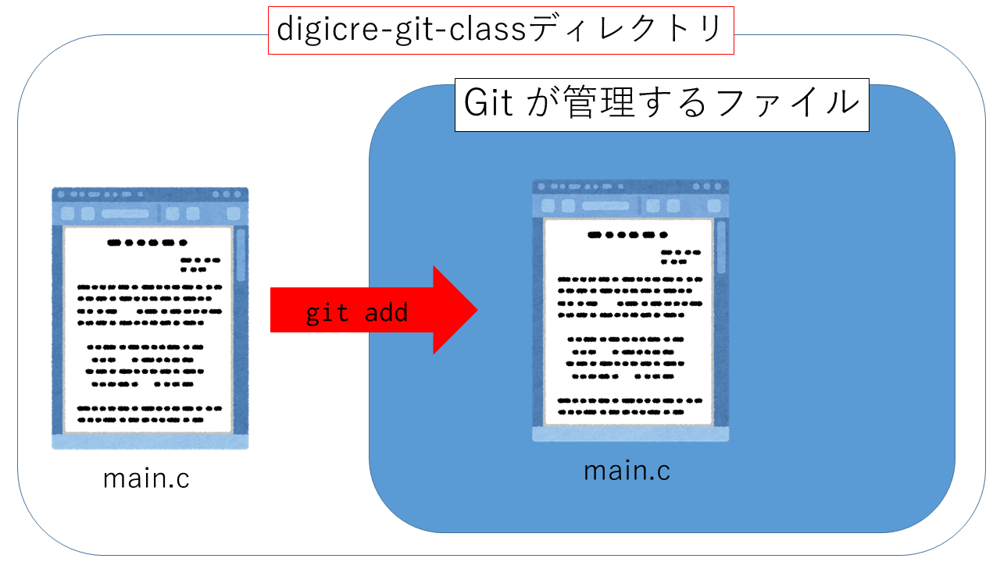
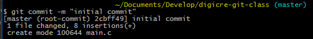

# 4.コミットをしてみよう

## 最初のコミット

さて、git init をしたわけですから、早速Gitでファイルを管理していきましょう。と、いきたいところですが、管理するファイルがないと意味がありません。ということで、管理するためのファイルを作成しましょう。今回は実際にプログラムをつくくるわけではありません。とりあえず好きなエディタを開いてください。特にこだわりがない人はnotepad++を起動してください。

### 脱線: エディタの話

普段プログラムを書くときにどのエディタを利用していますか。Visual Studioを入れているだけ、という人も多いのではないでしょうか。一般的にエディタと言われるものをいれておくと便利に使えることが多いので、この機会にインストールしてみてはいかがでしょうか。

エディタにはざまざまなものが存在します。紹介したnotepad++の他に、筆者は次のようなエディタを利用しています。

* Sublime Text
* Atom
* VSCode
* Vim

どういったものをインストールしても構わないのですが、自分の開発したいものなどと相談して考えましょう。

### ファイルをディレクトリに保存

適当にファイルに書き込んでいきましょう。別にどんなことでもよいのですが、変更の必要性が理解しやすいので、ここでは下にあるプログラムをコピー & ペーストしてください。

```c
#include <stdio.h>

int main(void){
    for(int i = 0;i < 10;i++){
        printf("%d\n",i*i);
    }
    return 0;
}
```

なんの変哲も無いcプログラムですね。とりあえずこれをmain.cという名前で digicre-git-class/ の下に保存してください。

**注意** : notepad++でファイルを保存するときは、下の拡張子の欄からC source fileを選択してください。



## ステージングとgit add

digicre-git-classディレクトリは今こんな感じになっています。



この時点で main.c はGitによって管理されているのかというと、実はそうではありません。次のコマンドを Git Bashで実行して見てください。

```
git status
```

すると次のようなメッセージがでてきたのはないでしょうか。

```bash
On branch master

Initial commit

Untracked files:
   (use "git add <file>..." to include in what will be committed)

        main.c

nothing added to commit but untracked files present (use "git add" to track)
```

よくわからない英語がたくさん並んでいますね。とりあえず多くの部分はおまじないだということにして、今必要なことだけを説明していきます。

「Untracked files」という文章があります。「track」という英単語は「追う」という意味があります。「untracked file」という単語は「追跡されていないファイル」、つまりGitがそのファイルの変更などを管理していないということを表します。図で表すとこんな感じです。



では、このmain.cをGitに管理してもらうにはどうすればいいでしょうか。ここで、`git add`というコマンドを使います。Git Bashでdigicre-git-classディレクトリにいることを確認して、次のコマンドを実行してみてください。

```bash
git add main.c
```

こうすると、Gitはmain.cを次回コミットに含めるファイルとしてmain.cを追加します。
このようにGitに追跡するファイル（変更）を追加することを **ステージ（stage）する** 、または  **ステージング（staging）** といいます。



もう一度　`git status`コマンドを実行してみてください。ちなみに、このgit status コマンドは現在のレポジトリの状況を確認するためのコマンドです。今どうなっているのかわからなくなったら、とりあえずこのコマンドを実行してみるのがよいでしょう。今実行すると、こんなふうに表示されるのではないでしょうか。

```bash
On branch master

Initial commit

Changes to be committed:
  (use "git rm --cached <file>..." to unstage)

        new file:   main.c
```

これでmain.cがステージされているファイルだということがわかります。

## Git commit

これで、main.cはGitで管理されるファイルになりました。しかしファイルの変更が記録されているわけではありません。ファイルの変更を記録することを **コミットする** と言います。早速やってみましょう。次のコマンドを実行してみてください。

```bash
git commit -m "initial commit"
```

このような文章が表示されていればコミットは成功です。



コマンドの ` -m`というオプションは、 **コミットメッセージ** を指定するものです。コミット時、つまりファイルの変更を保存するときにつけるメッセージをコミットメッセージと言います。これによって、開発する人はこのコミット時になにを変更したのかなどを把握することが可能となります。コードを日ごとに保存する方法だと、何か別のファイルを用意してそこに書かなければいけないことを考えると、これは非常に簡単ですね。

実際にコミットされているかを確認するために、コマンドを実行してみてください。

```bash
git log
```

先ほどコミットした時刻とコミットメッセージ、ユーザー名などが記録されていますね。このように `git log`コマンドを使うことで自分のコミットの履歴を確認することもできます。

## もうすこしステージングとコミット

これで、コミットまでの動作は確認できました。

1. ファイルを編集する・作成する
2. 変更に加えたいファイルをステージングする
3. 適当なメッセージをつけてコミットする

もうすこしコミットとステージングの練習をしてみましょう。先ほど作ったmain.cですが、プログラムに機能を追加してみることにしました。


```c
#include <stdio.h>

int main(void){
    for(int i = 0;i < 10;i++){
        printf("%d\n",i*i);
    }
    for(int i = 0;i < 100;i++){
        if(i % 2 == 0) {
            printf("%d\n",i);
        }
    }
    return 0;
}
```

0から100までの偶数を表示する機能をプログラムに追加しました。main.cをエディタで開いて、一度コードを消したあとにこのコードを上から追加してみてください。notepad++なら、ファイルを右クリックすれば「Edit with notepad++」というメニューが出ますので、それをクリックすればnotepad++で開くことができます。

変更が終わったら、また状態を確認してみましょう。 Git Bashで`git status`を実行してみてください。次のようになったのではないでしょうか。

```bash
On branch master
Changes not staged for commit:
  (use "git add <file>..." to update what will be committed)
  (use "git checkout -- <file>..." to discard changes in working directory)

        modified:   main.c

no changes added to commit (use "git add" and/or "git commit -a")

```

すこし先ほどとは変わっていますね。「Untracked file」等書かれていた箇所に、「Changes not staged for commit」と書かれています。これはつまり「変更されたけどステージングされてないからコミットされないよ」という意味です。これをコミットへ含めるためにはどのようにすればよいのでしょうか。もちろん、`git add`ですね。Git Bashで`git add main.c`を実行してください。

`git add`を実行したあと、`git status`を実行してみると先ほど見かけた結果が現れます。

```bash
On branch master
Changes to be committed:
  (use "git reset HEAD <file>..." to unstage)

        modified:   main.c
```

上では「ファイルのステージング」という表現を使いましたが、正確には「ファイルを作成した変更」がステージングされたことを意味します。今回はmain.cに先ほど追加した変更がステージングされたことになります。またコミットしていきましょう。

```
git commit -m "偶数表示を追加"
```

コミットメッセージは日本語でも構いません。場合によっては英語だけで書くべき場もありますが、僕らが普段ちょっとしたものをつくる程度のときは日本語でも構いません。無理して英語を使おうとせず、なにを変更したのかをわかりやすく書くことが大切です。

コミットがされたか確認してみましょう。`git log`を実行してみてください。先ほどのコミットの上に、今行ったコミットが表示されているはずです。

## まとめ

* ファイルの変更を `git add `を実行してステージングする
* 変更を`git commit`でコミットする
* コミットメッセージはなにをしたかをわかりやすく
